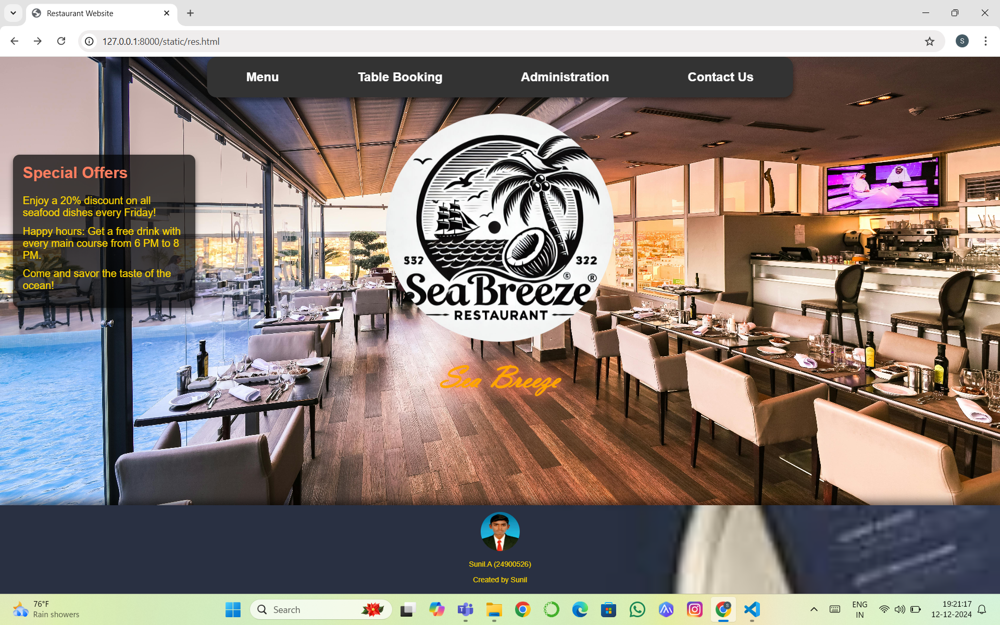
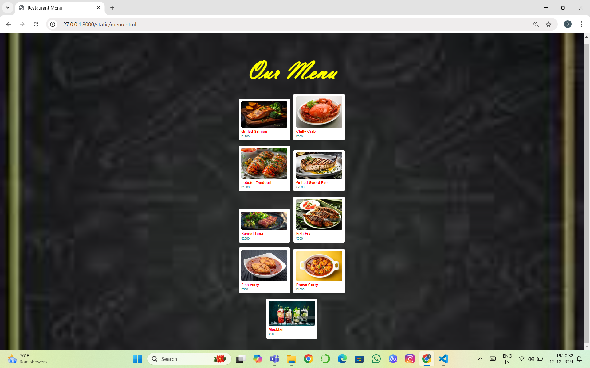
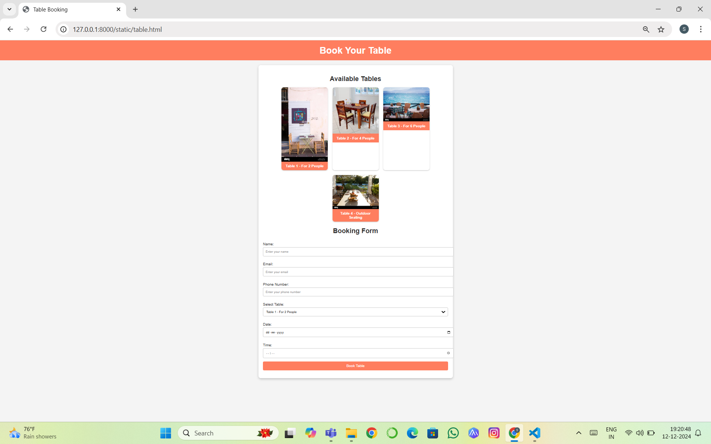
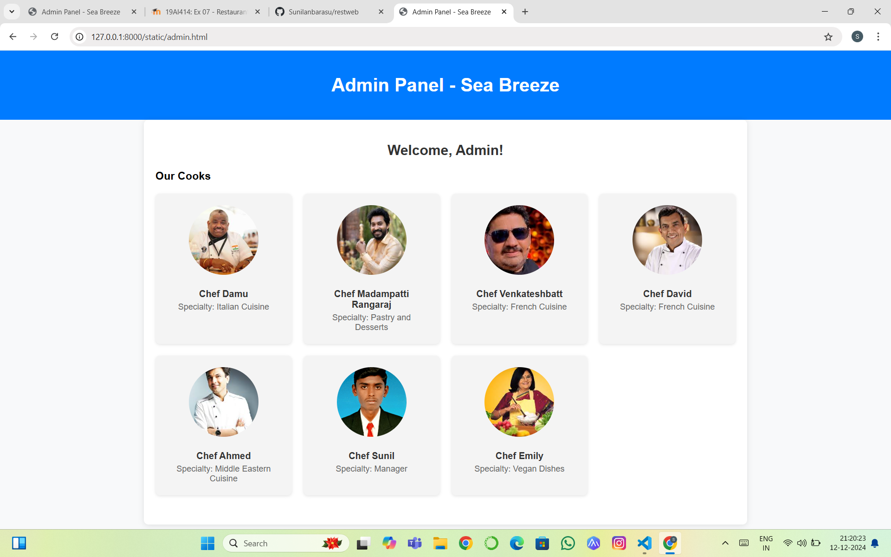

# Ex.07 Restaurant Website
## Date:12-12-24

## AIM:
To develop a static Restaurant website to display the food items and services provided by them.

## DESIGN STEPS:

### Step 1:
Requirement collection.

### Step 2:
Creating the layout using HTML and CSS.

### Step 3:
Updating the sample content.

### Step 4:
Choose the appropriate style and color scheme.

### Step 5:
Validate the layout in various browsers.

### Step 6:
Validate the HTML code.

### Step 7:
Publish the website in the given URL.

## PROGRAM:
```
res.html

<!DOCTYPE html>
<html lang="en">
<head>
    <meta charset="UTF-8">
    <meta name="viewport" content="width=device-width, initial-scale=1.0">
    <title>Restaurant Website</title>
    <style>
        body {
            font-family: Arial, sans-serif;
            margin: 0;
            padding: 0;
            background: url('abcd.jpg') no-repeat center center/cover;
            color: #fff;
            text-align: center;
            overflow: hidden;
            animation: fadeIn 2s ease-out;
        }
        @keyframes fadeIn {
            0% { opacity: 0; }
            100% { opacity: 1; }
        }
        header {
            padding: 100px 20px 50px;
        }
        header img {
            width: 350px;
            height: 350px;
            border-radius: 70%; 
            margin-bottom: 10px;
            animation: bounce 2s ease-in-out infinite; 
        }
        @keyframes bounce {
            0%, 100% { transform: translateY(0); }
            50% { transform: translateY(-15px); }
        }
        header h1 {
            font-family: 'Vladimir Script', cursive;
            font-size: 48px;
            margin: 0;
            color: orange;
            animation: glowText 1.5s ease-in-out infinite alternate; 
        }
        @keyframes glowText {
            0% { text-shadow: 0 0 20px #ff7e5f, 0 0 30px #ff7e5f; }
            100% { text-shadow: 0 0 30px #ff6347, 0 0 50px #ff6347; }
        }
        .links-container {
            background-color: #333; 
            position: fixed;
            top: 0;
            left: 50%;
            transform: translateX(-50%);
            display: flex;
            justify-content: space-around;
            width: 100%;
            max-width: 900px; 
            padding: 10px 0;
            border-radius: 15px;
            box-shadow: 0 4px 8px rgba(0, 0, 0, 0.5);
            z-index: 1000;
        }
        .link {
            font-size: 1.2em;
            font-weight: bold;
            text-decoration: none;
            color: #fff;
            padding: 10px 20px;
            transition: color 0.3s ease-in-out;
        }
        .link:hover {
            color: #ff6347; 
        }

        .link:active {
            transform: translateY(2px);
        }
        .offers-box {
            position: absolute;
            top: 150px;
            left: 20px;
            width: 250px;
            background-color: rgba(0, 0, 0, 0.7);
            color: #ffd700;
            padding: 15px;
            border-radius: 10px;
            box-shadow: 0 4px 8px rgba(0, 0, 0, 0.5);
            text-align: left;
        }

        .offers-box h2 {
            margin-top: 0;
            font-size: 1.5em;
            color: #ff7e5f;
        }

        .offers-box p {
            font-size: 1em;
            margin: 10px 0;
        }
        footer {
            background: url('fbg.jpeg') no-repeat center center/cover; 
            background-size: cover;
            color: #ffd700;
            padding: 5px 0; 
            font-size: 0.7em; 
            position: fixed;
            bottom: 0;
            left: 0;
            right: 0;
            text-align: center;
            z-index: 1;
            box-shadow: 0 -5px 15px rgba(0, 0, 0, 0.6); 
        }

        footer img {
            width: 60px;
            height: 60px;
            border-radius: 70%;
            margin-top: 5px;
        }
    </style>
</head>
<body>
    <header>
        
        <h1>Sea Breeze</h1>
    </header>

    <div class="links-container">
        <a href="menu.html" class="link">Menu</a>
        <a href="table.html" class="link">Table Booking</a>
        <a href="admin.html" class="link">Administration</a>
        <a href="contact.html" class="link">Contact Us</a>
    </div>

    <div class="offers-box">
        <h2>Special Offers</h2>
        <p>Enjoy a 20% discount on all seafood dishes every Friday!</p>
        <p>Happy hours: Get a free drink with every main course from 6 PM to 8 PM.</p>
        <p>Come and savor the taste of the ocean!</p>
    </div>

    <footer>
        
        <p>Sunil.A (24900526)</p>
        <p>Created by Sunil</p>
    </footer>
</body>
</html>


menu.html

<!DOCTYPE html>
<html lang="en">
<head>
    <meta charset="UTF-8">
    <meta name="viewport" content="width=device-width, initial-scale=1.0">
     
    <title>Restaurant Menu</title>
    <style>
        body {
            font-family: Arial, sans-serif;
            fond color:yellow;
background: url('menubg.jpeg') no-repeat center center/cover;
            margin: 0;
            padding: 0;
        }

        .menu {
            max-width: 1200px;
            margin: 50px auto;
            padding: 20px;
            color:red;
            text-align: center;
            
        }

        h1 {
            font-size: 2.5em;
            margin-bottom: 40px;
            
font-family: 'Vladimir Script';
color: yellow;
             font-size: 200px;
text-decoration: underline;
  text-decoration-style: double;
text-decoration-thickness: 4px;
  text-underline-offset: 50px;

        }

        .menu-item {
            display: inline-block;
            width: 30%;
            margin: 20px 1%;
            padding: 20px;
            background-color: #fff;
            border-radius: 10px;
            box-shadow: 0 4px 8px rgba(0, 0, 0, 0.1);
            text-align: left;
            font-size: 1.2em;
            transition: transform 0.3s ease-in-out;
        }

        .menu-item img {
            width: 100%;
            height: auto;
            border-radius: 8px;
        }

        .menu-item:hover {
            transform: translateY(-5px);
        }

        .menu-item .item-name {
            font-weight: bold;
            font-size: 1.5em;
            margin-top: 10px;
        }

        .menu-item .item-price {
            color: #2d8d8f;
            font-size: 1.2em;
            margin-top: 5px;
        }

        @media (max-width: 768px) {
            .menu-item {
                width: 45%;
            }
        }

        @media (max-width: 480px) {
            .menu-item {
                width: 100%;
            }
        }
    </style>
</head>
<body>

    <div class="menu">
        <h1>Our Menu</h1>
        
        
        <div class="menu-item">
            
            <div class="item-name">Grilled Salmon</div>
            <div class="item-price">₹1200</div>
        </div>
        
        <div class="menu-item">
            
            <div class="item-name">Chilly Crab</div>
            <div class="item-price">₹800</div>
        </div>
        
        <div class="menu-item">
            
            <div class="item-name">Lobster Tandoori</div>
            <div class="item-price">₹1600</div>
        </div>
        
        <div class="menu-item">
            
            <div class="item-name">Grilled Sword Fish</div>
            <div class="item-price">₹2000</div>
        </div>
        
        <div class="menu-item">
            
            <div class="item-name">Seared Tuna</div>
            <div class="item-price">₹2500</div>
        </div>
        
        <div class="menu-item">
            
            <div class="item-name">Fish Fry </div>
            <div class="item-price">₹600</div>
        </div>
        
        <div class="menu-item">
            
            <div class="item-name">Fish curry</div>
            <div class="item-price">₹550</div>
        </div>
        
        <div class="menu-item">
            
            <div class="item-name">Prawn Curry</div>
            <div class="item-price">₹1000</div>
        </div>
        
        <div class="menu-item">
            
            <div class="item-name">Mocktail</div>
            <div class="item-price">₹500</div>
        </div>
        
    </div>

</body>
</html>

table.html

<!DOCTYPE html>
<html lang="en">
<head>
    <meta charset="UTF-8">
    <meta name="viewport" content="width=device-width, initial-scale=1.0">
    <title>Table Booking</title>
    <style>
        body {
            font-family: Arial, sans-serif;
            margin: 0;
            padding: 0;
            background: #f4f4f4;
            color: #333;
            text-align: center;
        }

        header {
            background: #ff7e5f;
            color: white;
            padding: 20px 0;
        }

        header h1 {
            margin: 0;
            font-size: 2.5em;
        }

        .container {
            max-width: 800px;
            margin: 20px auto;
            padding: 20px;
            background: white;
            border-radius: 10px;
            box-shadow: 0 4px 10px rgba(0, 0, 0, 0.2);
        }

        .container h2 {
            font-size: 1.8em;
            margin-bottom: 20px;
        }

        .table-gallery {
            display: flex;
            flex-wrap: wrap;
            gap: 20px;
            justify-content: center;
        }

        .table {
            width: 200px;
            border-radius: 10px;
            overflow: hidden;
            box-shadow: 0 2px 5px rgba(0, 0, 0, 0.2);
        }

        .table img {
            width: 100%;
            display: block;
        }

        .table p {
            margin: 0;
            padding: 10px;
            background: #ff7e5f;
            color: white;
            font-weight: bold;
        }

        .booking-form {
            margin-top: 30px;
            text-align: left;
        }

        .booking-form label {
            display: block;
            margin: 10px 0 5px;
        }

        .booking-form input, .booking-form select, .booking-form button {
            width: 100%;
            padding: 10px;
            margin-bottom: 15px;
            border: 1px solid #ccc;
            border-radius: 5px;
        }

        .booking-form button {
            background: #ff7e5f;
            color: white;
            font-size: 1em;
            border: none;
            cursor: pointer;
        }

        .booking-form button:hover {
            background: #ff6347;
        }
    </style>
</head>
<body>
    <header>
        <h1>Book Your Table</h1>
    </header>

    <div class="container">
        <h2>Available Tables</h2>
        <div class="table-gallery">
            <div class="table">
                
                <p>Table 1 - For 2 People</p>
            </div>
            <div class="table">
                
                <p>Table 2 - For 4 People</p>
            </div>
            <div class="table">
                
                <p>Table 3 - For 6 People</p>
            </div>
            <div class="table">
                
                <p>Table 4 - Outdoor Seating</p>
            </div>
        </div>

        <h2>Booking Form</h2>
        <form class="booking-form">
            <label for="name">Name:</label>
            <input type="text" id="name" name="name" placeholder="Enter your name" required>

            <label for="email">Email:</label>
            <input type="email" id="email" name="email" placeholder="Enter your email" required>

            <label for="phone">Phone Number:</label>
            <input type="tel" id="phone" name="phone" placeholder="Enter your phone number" required>

            <label for="table">Select Table:</label>
            <select id="table" name="table">
                <option value="table1">Table 1 - For 2 People</option>
                <option value="table2">Table 2 - For 4 People</option>
                <option value="table3">Table 3 - For 6 People</option>
                <option value="table4">Table 4 - Outdoor Seating</option>
            </select>

            <label for="date">Date:</label>
            <input type="date" id="date" name="date" required>

            <label for="time">Time:</label>
            <input type="time" id="time" name="time" required>

            <button type="submit">Book Table</button>
        </form>
    </div>
</body>
</html>

admin.html

<!DOCTYPE html>
<html lang="en">
<head>
    <meta charset="UTF-8">
    <meta name="viewport" content="width=device-width, initial-scale=1.0">
    <title>Admin Panel - Sea Breeze</title>
    <style>
        body {
            font-family: Arial, sans-serif;
            margin: 0;
            padding: 0;
            background-color: #f8f9fa;
        }

        header {
            background-color: #007bff;
            color: white;
            text-align: center;
            padding: 20px;
        }

        nav {
            background-color: #0056b3;
            padding: 10px;
            text-align: center;
        }

        nav a {
            text-decoration: none;
            color: white;
            margin: 0 15px;
            font-weight: bold;
        }

        nav a:hover {
            text-decoration: underline;
        }

        .container {
            padding: 20px;
            max-width: 1000px;
            margin: 0 auto;
            background: white;
            border-radius: 8px;
            box-shadow: 0 2px 10px rgba(0, 0, 0, 0.1);
        }

        h2 {
            text-align: center;
            color: #333;
        }

        .section {
            margin-bottom: 30px;
        }

        button {
            padding: 10px 15px;
            background-color: #007bff;
            color: white;
            border: none;
            border-radius: 5px;
            cursor: pointer;
            display: block;
            margin: 10px auto;
        }

        button:hover {
            background-color: #0056b3;
        }

        .cooks {
            display: grid;
            grid-template-columns: repeat(auto-fit, minmax(200px, 1fr));
            gap: 20px;
        }

        .cook {
            text-align: center;
            background-color: #f4f4f4;
            padding: 20px;
            border-radius: 8px;
            box-shadow: 0 2px 5px rgba(0, 0, 0, 0.1);
        }

        .cook img {
            width: 120px;
            height: 120px;
            border-radius: 50%;
            object-fit: cover;
            margin-bottom: 10px;
        }

        .cook h4 {
            margin: 10px 0 5px;
            color: #333;
        }

        .cook p {
            margin: 0;
            font-size: 0.9em;
            color: #666;
        }
    </style>
</head>
<body>

    <!-- Header -->
    <header>
        <h1>Admin Panel - Sea Breeze</h1>
    </header>

  
    <!-- Main Content -->
    <div class="container">
        <h2>Welcome, Admin!</h2>

        <!-- Section: Cooks -->
        <div class="section">
            <h3>Our Cooks</h3>
            <div class="cooks">
                <div class="cook">
                    
                    <h4>Chef Damu</h4>
                    <p>Specialty: Italian Cuisine</p>
                </div>
                <div class="cook">
                    
                    <h4>Chef Madampatti Rangaraj</h4>
                    <p>Specialty: Pastry and Desserts</p>
                </div>
                <div class="cook">
                    
                    <h4>Chef Venkateshbatt</h4>
                    <p>Specialty: French Cuisine</p>
                </div>
                 <div class="cook">
                    
                    <h4>Chef David</h4>
                    <p>Specialty: French Cuisine</p>
                </div>
                <div class="cook">
                    
                    <h4>Chef Ahmed</h4>
                    <p>Specialty: Middle Eastern Cuisine</p>
                </div>
                <div class="cook">
                    
                    <h4>Chef Sunil</h4>
                    <p>Specialty: Manager</p>
                </div>
                <div class="cook">
                    
                    <h4>Chef Emily</h4>
                    <p>Specialty: Vegan Dishes</p>
                </div>
            </div>
        </div>
    </div>

</body>
</html>

!DOCTYPE html>
<html lang="en">
<head>
    <meta charset="UTF-8">
    <meta name="viewport" content="width=device-width, initial-scale=1.0">
    <title>Contact Us - Sea Breeze</title>
    <style>
        body {
            font-family: Arial, sans-serif;
            margin: 0;
            padding: 0;
            background-color: #f8f9fa;
            color: #333;
        }

        .container {
            max-width: 800px;
            margin: 0 auto;
            padding: 20px;
        }

        header {
            text-align: center;
            background-color: #007bff;
            color: white;
            padding: 10px 0;
        }

        h1 {
            margin: 0;
        }

        .contact-details {
            background-color: white;
            padding: 20px;
            border-radius: 5px;
            box-shadow: 0 2px 4px rgba(0, 0, 0, 0.1);
        }

        p {
            margin: 10px 0;
            line-height: 1.6;
        }

        footer {
            text-align: center;
            margin-top: 20px;
            font-size: 0.9em;
            color: #666;
        }
    </style>
</head>
<body>
    <header>
        <h1>Sea Breeze</h1>
        <p>Contact Us</p>
    </header>

    <div class="container">
        <div class="contact-details">
            <p><strong>Address:</strong> 123 Ocean View, Coastal City</p>
            <p><strong>Phone:</strong> (123) 456-7890</p>
            <p><strong>Email:</strong> contact@seabreeze.com</p>
            <p><strong>Opening Hours:</strong> Monday - Sunday: 10 AM - 10 PM</p>
        </div>
    </div>

    <footer>
        <p>&copy; 2024 Sea Breeze. All rights reserved.</p>
    </footer>
</body>
</html>

```


## OUTPUT:






## RESULT:
The program for designing software company website using HTML and CSS is completed successfully.
